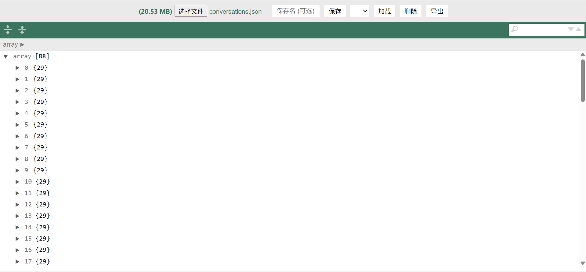
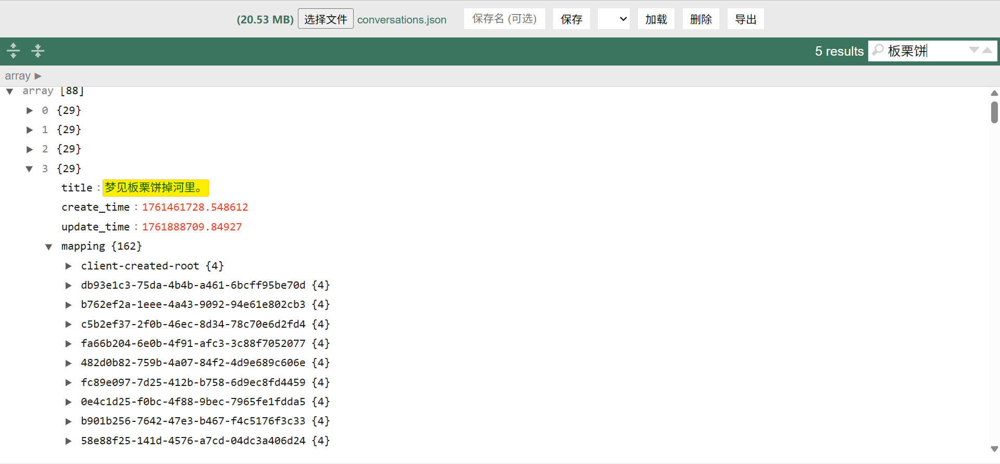

## 简介
json查看器。

## 在线
github page:  
https://kelushanqian.github.io/json_viewer/  
vercel:  
https://json-viewer-teal-two.vercel.app/

## 功能
- 从本地上传 JSON 文件（或拖放）并在页面里美观显示（使用 JSONEditor）
- 将当前 JSON 存入浏览器的 IndexedDB，并可给文件命名
- 支持全文搜索，并且能够自动定位和切换所在的位置
- 列表查看、加载、删除已保存的 JSON 文件
- 可将已保存 JSON 导出为文件下载
- 有做手机端响应式布局

## 页面

## 闲聊
本来是让小agent弄个小工具，让我方便看导出的conversations.json数据的。试过在chrome直接打开点美观输出的，结果一点一个无响应。

没想到小agent做的还不错，各种json都能看。在可视化那个项目里没弄好的全文搜索功能，就这样美丽地实现了。